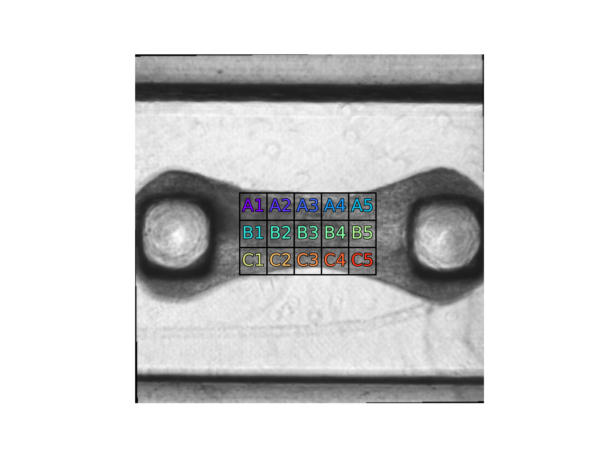
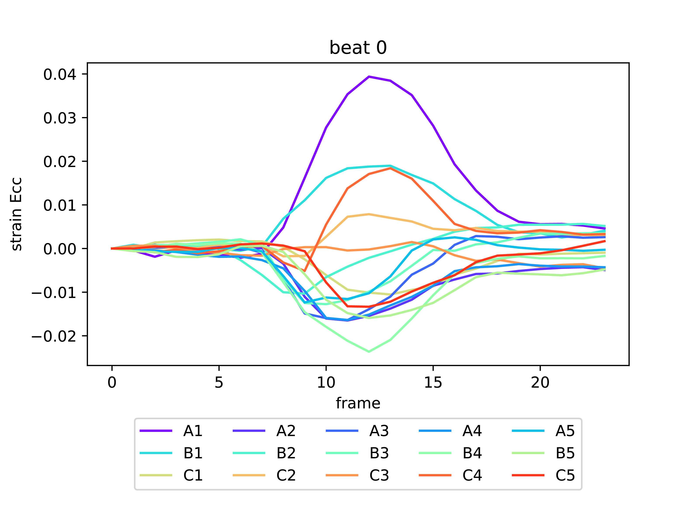
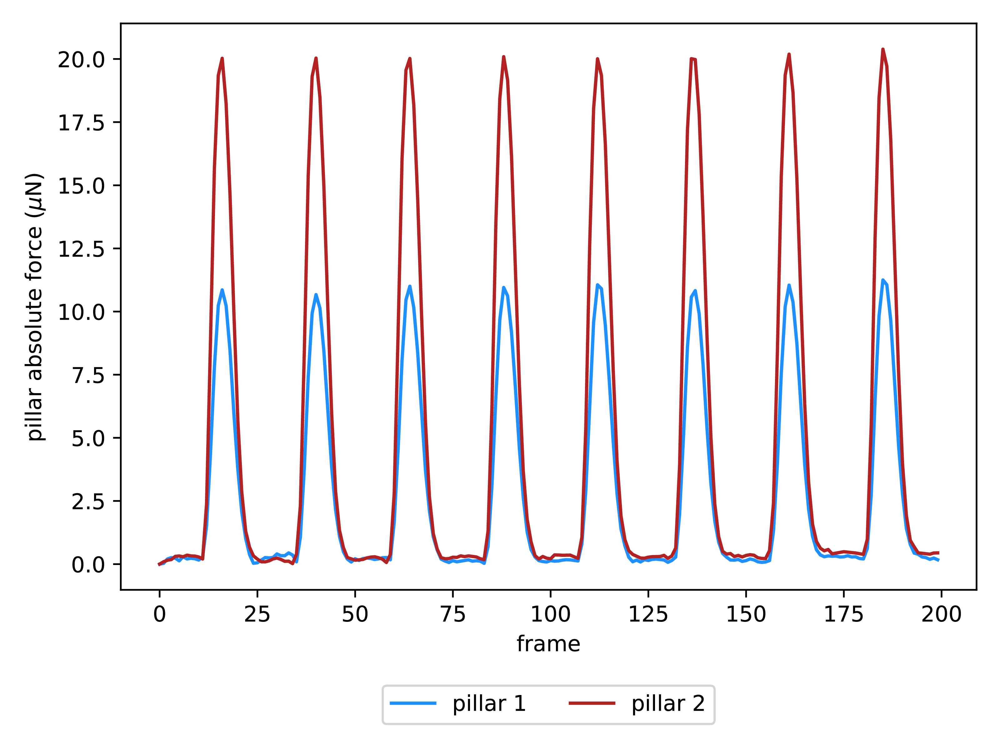
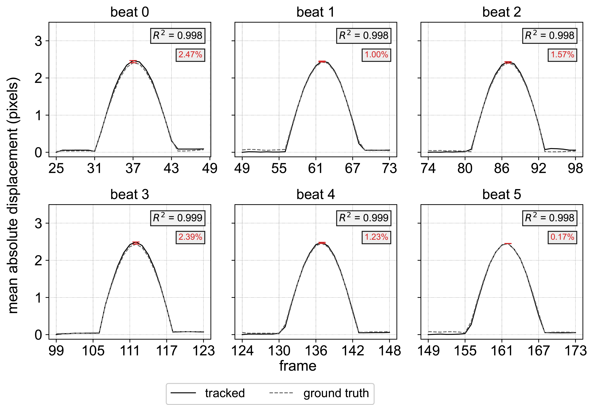
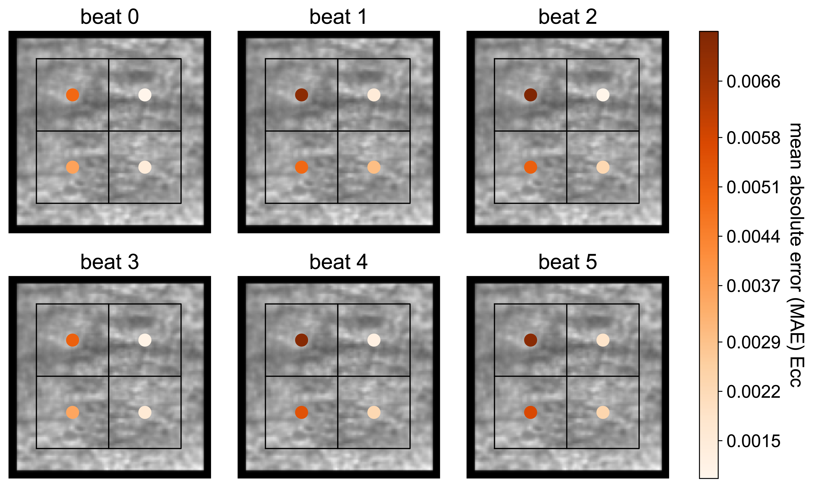
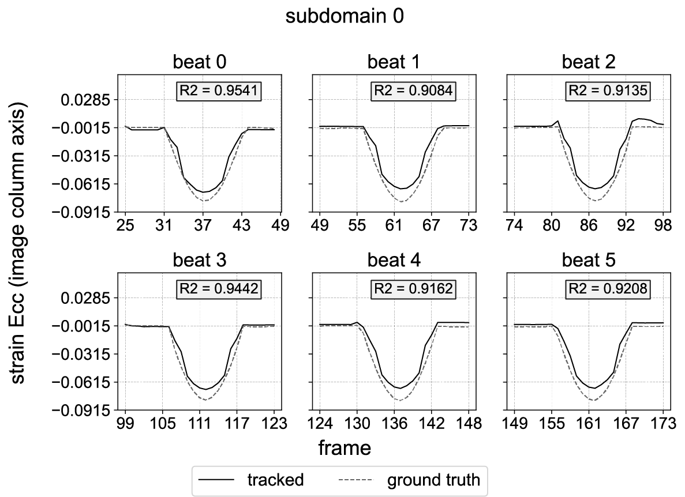

# Microbundle Compute Repository

<!---
We will configure these once we make the repository public:
[](https://www.python.org/)

[](https://github.com/sandialabs/sibl#license)

[](https://github.com/elejeune11/microbundlecompute/actions) [](https://codecov.io/gh/elejeune11/microbundlecompute)
-->

## Table of Contents
* [Project Summary](#summary)
* [Project Roadmap](#roadmap)
* [Installation Instructions](#install)
* [Tutorial](#tutorial)
* [Validation](#validation)
* [To-Do List](#todo)
* [References to Related Work](#references)
* [Contact Information](#contact)
* [Acknowledgements](#acknowledge)

## Project Summary <a name="summary"></a>
The MicroBundleCompute software is developed as a multi-purpose tool for analyzing heterogeneous cardiac microtissue deformation and strain from brightfield movies of beating microtissue. In this repository, we share the source code, steps to download and install the software, tutorials on how to run the different main and optional functionalities of the software, and details about code validation. **For more information, please refer to the main [manuscript](add link).**

Briefly, the software requires two main inputs: `1)` a binary mask of the tissue and `2)` consecutive movie frames of the beating microtissue. The mask can be either generated manually or externally, or automatically using one of the software’s built-in functionalities. Tracking points identified as Shi-Tomasi corner points are then computed on the first frame of the movie and tracked
across all frames. From this preliminary tracking, we can identify individual beats. This allows us to perform the analysis per beat by tracking the
marker points identified at the first frame of each beat across the beat frames. From these tracked points, we are able to compute full-field displacements,
and subdomain-averaged strains. We also include post-processing functionalities to rotate the images and tracking results as well as interpolate
the results at query points. To visualize the results, the software outputs timeseries plots per beat and movies of full-field results. Finally, we validate our software against synthetically generated beating microtissue data with a known ground truth.

<p align = "center">


Additionally, the user can also specify to track the pillars or posts to which the microtissue is attached. In this case, a mask for the pillars (posts) should be provided. The outputs for this tracking option are timeseries plots of the pillars' mean absolute displacement and force results. We note that this additional functionality has not been vigorously validated at the moment.

We are also adding new functionalities to the code as well as enhancing the software based on user feedback. Please check our [to-do list]((#todo)).

## Project Roadmap <a name="roadmap"></a>
The ultimate goal of this project is to develop and disseminate a comprehensive software for data curation and analysis from lab-grown cardiac microtissue on different experimental constructs. Prior to the initial dissemination of the current version, we have tested our code on approximately 30 examples provided by 3 different labs who implement different techniques. This allowed us to identify challenging examples for the software and improve our approach. We hope to further expand both our testing dataset and list of contributors.
The roadmap for this collaborative endeavor is as follows:

`Preliminary Dataset + Software` $\mapsto$ `Published Software Package` $\mapsto$ `Published Validation Examples and Tutorial` $\mapsto$ `Larger Dataset + Software Testing and Validation` $\mapsto$ `Automated Analysis of High-Throughput Experiments`

At present (**march 2023**), we have validated our software on a preliminary dataset in addition to a synthetically generated dataset (please find more details on the [SyntheticMicroBundle github page](https://github.com/HibaKob/SyntheticMicroBundle) and the [main manuscript](**add link**)). We also include details on validation against manual tracking [here](**add link to SA**). In the next stage, we are particularly interested in expanding our dataset and performing further software validation and testing. 
 Specifically, we aim to `1)` identify scenarios where our approach fails, `2)` create functions to accomodate these cases, and `3)` compare software results to previous manual approaches for extracting quantitative information, especially for pillar tracking. We will continue to update this repository as the project progresses.

## Installation Instructions <a name="install"></a>

### Get a copy of the microbundle compute repository on your local machine

The best way to do this is to create a GitHub account and ``clone`` the repository. However, you can also download the repository by clicking the green ``Code`` button and selecting ``Download ZIP``. Download and unzip the ``MicroBundleCompute-master`` folder and place it in a convenient location on your computer.

Alternatively, you can run the following command in a ``Terminal`` session:
```bash
git clone https://github.com/elejeune11/MicroBundleCompute.git
```
Following this step, ``MicroBundleCompute`` folder will be downloaded in your ``Terminal`` directory. 

### Create and activate a conda virtual environment

1. Install [Anaconda](https://docs.anaconda.com/anaconda/install/) on your local machine.
2. Open a ``Terminal`` session (or equivalent) -- note that Mac computers come with ``Terminal`` pre-installed (type ``⌘-space`` and then search for ``Terminal``).
3. Type in the terminal to create a virtual environment with conda:
```bash
conda create --name microbundle-compute-env python=3.9.13
```
4. Type in the terminal to activate your virtual environment:
```bash
conda activate microbundle-compute-env
```
5. Check to make sure that the correct version of python is running (should be ``3.9.13``)
```bash
python --version
```
6. Update some base modules (just in case)
```bash
pip install --upgrade pip setuptools wheel
```

Note that once you have created this virtual environment you can ``activate`` and ``deactivate`` it in the future -- it is not necessary to create a new virtual environment each time you want to run this code, you can simply type ``conda activate microbundle-compute-env`` and then pick up where you left off (see also: [conda cheat sheet](https://docs.conda.io/projects/conda/en/4.6.0/_downloads/52a95608c49671267e40c689e0bc00ca/conda-cheatsheet.pdf)).


### Install microbundle compute

1. Use a ``Terminal`` session to navigate to the ``MicroBundleCompute-master`` folder or ``MicroBundleCompute`` folder (depending on the method you followed to download the github repository). The command ``cd`` will allow you to do this (see: [terminal cheat sheet](https://terminalcheatsheet.com/))
2. Type the command ``ls`` and make sure that the file ``pyproject.toml`` is in the current directory.
3. Now, create an editable install of microbundle compute:
```bash
pip install -e .
```
4. If you would like to see what packages were installed, you can type ``pip list``
5. You can test that the code is working with pytest (all tests should pass):
```bash
pytest -v --cov=microbundlecompute  --cov-report term-missing
```
6. To run the code from the terminal, simply start python (type ``python``) and then type ``from microbundlecompute import image_analysis as ia``. For example:
```bash
(microbundle-compute-env) hibakobeissi@Hibas-MacBook-Pro ~ % python
Python 3.9.13 (main, Oct 13 2022, 16:12:19) 
[Clang 12.0.0 ] :: Anaconda, Inc. on darwin
Type "help", "copyright", "credits" or "license" for more information.
>>> from microbundlecompute import image_analysis as ia
>>> ia.hello_microbundle_compute()
'Hello World!'
>>> 
```

## Tutorial <a name="tutorial"></a>
This GitHub repository contains a folder called ``tutorials`` that contains an example dataset and a python script for running the code. To run the tutorials, change your curent working directory to the ``tutorials`` folder.

The data (frames to be tracked) will be contained in the ``movie`` folder. Critically:
1. The files must have a ``.TIF`` extension.
2. The files can have any name, but in order for the code to work properly they must be *in order*. For reference, we use ``sort`` to order file names. By default, this function sorts strings (such as file names) alphabetically and numbers numerically. We provide below examples of good and bad file naming practices. 

```bash
(microbundle-compute-env) hibakobeissi@Hibas-MacBook-Pro MicroBundleCompute-master % python
Python 3.9.13 (main, Oct 13 2022, 16:12:19) 
[Clang 12.0.0 ] :: Anaconda, Inc. on darwin
Type "help", "copyright", "credits" or "license" for more information.
>>> bad_example = ["1","2","3","4","5","6","7","8","9","10","11","12","13","14","15"]
>>> bad_example.sort()
>>> print(bad_example)
['1', '10', '11', '12', '13', '14', '15', '2', '3', '4', '5', '6', '7', '8', '9']
>>> 
>>> good_example = ["01","02","03","04","05","06","07","08","09","10","11","12","13","14","15"]
>>> good_example.sort()
>>> print(good_example)
['01', '02', '03', '04', '05', '06', '07', '08', '09', '10', '11', '12', '13', '14', '15']
>>>
>>> another_good_example = ["test_001","test_002","test_003","test_004","test_005","test_006","test_007","test_008","test_009","test_010","test_011","test_012","test_013","test_014","test_015"]
>>> another_good_example.sort()
>>> print(another_good_example)
['test_001', 'test_002', 'test_003', 'test_004', 'test_005', 'test_006', 'test_007', 'test_008', 'test_009', 'test_010', 'test_011', 'test_012', 'test_013', 'test_014', 'test_015']
```

3. If it is necessary to read other file types or formats (e.g., a single 3D TIFF array), that would be easy to implement -- single images are implemented now so that we don't exceed maximum file sizes allowable on GitHub.


All masks, whether for the tissue or the pillars, will be contained in the ``masks`` folder. Critically:
1. The current version of the code can use externally generated masks titled ``tissue_mask.txt`` for the tissue and ``pillar_mask_1.txt`` and ``pillar_mask_2.txt`` for the pillars. We note here that if the user wishes to track one pillar only, it is enough to provide either ``pillar_mask_1.txt`` or ``pillar_mask_2.txt``.
3. Future functionality for new mask generation functions is possible.
4. In our examples, ``tissue_mask.png``, ``pillar_mask_1.png``, and ``pillar_mask_2.png`` are simply visualizations of the corresponding mask text files. They are not necessary to run the code.

For the code to work properly, we provide below an example of the initial folder structure if both tissue and pillar tracking are to be run. Alternatively, if only one option is chosen, the corresponding mask(s) only is(are) required to be contained in the ``masks`` folder.
```bash
|___ example_folder
|        |___ movie
|                |___"*.TIF"
|        |___ masks    (this folder can be omitted if automated mask generation will be run as a first step and tissue tracking is run only. It is crucial to have this folder if pillar tracking is chosen)
|                |___"tissue_mask.txt"
|                |___"tissue_mask.png"        (optional)
|                |___"pillar_mask_1.txt"      
|                |___"pillar_mask_1.png"      (optional)
|                |___"pillar_mask_2.txt"
|                |___"pillar_mask_2.png"      (optional)

```
### Current core functionalities
In the current version of the code, there are 5 core functionalities available for tissue tracking (automatic mask generation, tracking, displacement results visualization, strain computation, and strain results visualization) and 2 core functionalities for pillar tracking (tracking, displacement and pillar force results visualization). As a brief note, it is not necessary to use all functionalities (e.g., you can consider displacement results but ignore strain calculations for tissue tracking or skip the visualization steps).

 To be able to run the code, we stress that for the code snippets in this section, the variable ``input_folder`` is a [``PosixPath``](https://docs.python.org/3/library/pathlib.html) that specifies the relative path between where the code is being run (for example the provided ``tutorials`` folder) and the ``example_folder`` defined [above](#data_prep) that the user wishes to analyze.
#### Tissue tracking
If the user wishes to use the ``run_code.py`` file to run the software, the ``track_mode`` should be specified as indicated below:

```bash
"""Specify if pillar or tissue tracking"""
track_mode = "tissue" # "pillar" or "tissue"
```
 Alternatively, the user can run the tissue tracking functions directly in a ``microbundle-compute-env`` python terminal as we show below.

The function ``run_create_tissue_mask`` will use a specified segmentation function (e.g., ``seg_fcn_num = 1``), a movie frame number (e.g., ``frame_num = 0``), and a method (e.g., ``method = "minimum"``) to create a tissue mask text file with the name specified by the variable ``fname``. The subsequent steps of the code will require a file called ``tissue_mask.txt`` that should either be created with this function or manually. At present, there are three segmentation function types available: ``1)`` a straightforward threshold base
d mask, ``2)`` a threshold based mask that is applied after a Sobel filter, and ``3)`` a straightforward threshold based mask that is applied to either the ``minimum`` or the ``maximum`` (specified by the ``method`` input) of all movie frames. 

```bash
from microbundlecompute import create_tissue_mask as ctm
from pathlib import Path

seg_fcn_num = 3
fname = "tissue_mask"
frame_num = 0
method = "minimum"
ctm.run_create_tissue_mask(input_folder, seg_fcn_num, fname, frame_num, method)
```
##### Fiducial marker identification, tracking, and visualization

The function ``run_tracking`` will automatically read the data specified by the input folder (tiff files and mask file), run tracking, segment individual beats in time, and save the results as text files.

It is essential to provide the ``run_tracking`` function with two movie parameters: ``1)`` the frames per second (fps) and ``2)`` the length scale (ls) in units of $\mu m/pixel$. We currently output all displacement results in units of pixels but the movie parameters are implemented to calculate tissue beating frequency in $Hz$ ($1/s$), and tissue beating amplitude, and tissue thickness in $\mu m$. If both parameters are inputted as $1$ like in the example below, tissue beating frequency would be outputted in units of $1/frames$ and tissue beating amplitude and tissue thickness would be outputted in units of $pixels$.

```bash
from microbundlecompute import image_analysis as ia
import matplotlib.pyplot as plt
from pathlib import Path

fps = 1 
ls = 1

input_folder = Path(folder_path)
 # run the tracking
ia.run_tracking(input_folder,fps,ls)
    
# run the tracking visualization
automatic_color_constraint = True # Put False if manual limits are to be specified
col_min = 0
col_max = 3
col_map = plt.cm.viridis
ia.run_visualization(input_folder, automatic_color_constraint, col_min, col_max, col_map)
```

The function ``run_visualization`` is for visualizing the tracking results. The inputs ``col_max``, ``col_min``, and ``col_map`` are the maximum displacement in pixels, the minimum displacement in pixels, and the [matplotlib colormap](https://matplotlib.org/stable/tutorials/colors/colormaps.html) selected for visualization, respectively. If the input ``automatic_color_constraint`` is put as ``True``, the input values for ``col_max`` and ``col_min`` will be overwritten by the values automatically calculated by the code.  

<p align = "center">


##### Post-tracking rotation
It is possible that the images may not be aligned with the desired global coordinate system, being in the horizontal and vertical directions for this code. After tracking, it is possible to rotate both the images and the tracking results based on a specified center of rotation and desired horizontal axis vector. Note that rotation must be run after tracking. This was an intentional ordering as rotating the images involves interpolation which will potential lead to loss of information. To automatically rotate based on the mask, run the code with the following inputs:

```bash
input_mask = True  # this will use the mask to determine the rotation vector.
ia.run_rotation(input_folder, input_mask)
```

<p align = "center">


To rotate based on specified center, set ``input_mask = False`` and provide additional command line arguments. For example:

```bash
input_mask = False
center_row_input = 100
center_col_input = 100
vec_input = np.asarray([1, 0])

ia.run_rotation(input_folder, input_mask, center_row_input=center_row_input, center_col_input=center_col_input, vec_input=vec_input)
```

To visualize the rotated results, run the ``run_rotation_visualization`` function. For example: 

```bash
automatic_color_constraint = True # Put False if manual limits are to be specified
col_min = 0
col_max = 3
col_map = plt.cm.viridis

ia.run_rotation_visualization(input_folder, automatic_color_constraint=automatic_color_constraint, col_min=col_min, col_max=col_max,col_map = col_map)
```

Note: We also provide a function ``run_scale_and_center_coordinates()`` to transform the tracking results (rescale and center). If needed, this should be used as a final step.

##### Post-tracking interpolation and visualization
The tracking results are returned at the automatically identified fiducial marker points. However, it may be useful to know displacements at other locations (e.g., on a grid). After tracking and rotation, we can interpolate the displacement field to specified sampling points. For example one can do:

```bash
row_vec = np.linspace(230, 320, 12)
col_vec = np.linspace(105, 375, 26)
row_grid, col_grid = np.meshgrid(row_vec, col_vec)
row_sample = row_grid.reshape((-1, 1))
col_sample = col_grid.reshape((-1, 1))
row_col_sample = np.hstack((row_sample, col_sample))
fname = "interpolated_rotated"
ia.run_interpolate(input_folder, row_col_sample, fname, is_rotated=True)
```

<p align = "center">

</p>

##### Post-tracking strain computation and visualization
After tracking, we can compute sub-domain strains. The function ``run_sub_domain_strain_analysis`` will automatically rotate the microtissue before performing strain sub-domain analysis to match the global row (vertical) vs. column (horizontal) coordinate system. To do this, we use the shape of the mask to automatically define an array of sub-domains. We note that there is no need for any prior rotation or interpolation.
The average strain within each sub-domain will then be computed from the tracking results. Altering the inputs to the function ``run_sub_domain_strain_analysis`` will change the way the sub-domains are initialized.

```bash
from microbundlecompute import strain_analysis as sa

# run the strain analysis (will automatically rotate based on the mask)
pillar_clip_fraction = 0.5
clip_columns = True
clip_rows = True
shrink_row = 0.1
shrink_col = 0.1
tile_dim_pix = 40
num_tile_row = 3
num_tile_col = 5
tile_style = 1 # or 2
manual_sub = False # or True
sub_extents = None # if manual_sub = True provide as [r0,r1,c0,c1]
sa.run_sub_domain_strain_analysis(input_folder, pillar_clip_fraction, shrink_row, shrink_col, tile_dim_pix, num_tile_row, num_tile_col, tile_style, is_rotated = True,clip_columns=clip_columns,clip_rows=clip_rows, manual_sub=manual_sub, sub_extents=sub_extents)

# visualize the strain analysis results
automatic_color_constraint = True 
col_min = -0.025
col_max = 0.025
col_map = plt.cm.RdBu
sa.visualize_sub_domain_strain(input_folder, automatic_color_constraint, col_min, col_max, col_map, is_rotated = True)
```

The input ``pillar_clip_fraction`` allows the user to reduce the size of the region for strain computation by clipping from the tissue mask. The inputs ``clip_columns`` and ``clip_rows`` indicate whether the clipping is to take place in the column (horizontal) direction, row (vertical) direction, or both in directions. 

Alternatively, manual subdomain extents can be specified for subdomain strain computation. Simply set the input ``manual_sub = True`` and provide the corners of a rectangular domain as an input to ``sub_extents = [r0,r1,c0,c1]`` where ``r0,c0`` is the top left corner and ``r1,c1`` is the bottom right corner.

For subdomain division, choosing ``tile_style = 1`` will fit the maximum number of tiles with the specified side length ``tile_dim_pix``. For ``tile_style = 2``, the algorithm will use the specified grid size (``num_tile_row``, ``num_tile_col``) and adjust the side length. In other words, ``tile_style = 1`` will fix ``tile_dim_pix`` and adapt ``num_tile_row`` and ``num_tile_col`` accordingly, while ``tile_style = 2`` will retain the input values for ``num_tile_row`` and ``num_tile_col`` and calculate an appropriate ``tile_dim_pix``.

<p align = "center">

&nbsp
&nbsp

</p>

<p align = "center">

</p>

#### Pillar tracking
If the user wishes to use the ``run_code.py`` file to run the software, the ``track_mode`` should be specified as indicated below:

```bash
"""Specify if pillar or tissue tracking"""
track_mode = "pillar" # "pillar" or "tissue"
```
 Alternatively, the user can run the pillar tracking functions directly in a ``microbundle-compute-env`` python terminal as we show below.
As aforementioned, the user should provide at least one pillar mask in the masks folder saved according to the following format (``pillar_mask_*.txt``)
##### Fiducial marker identification, tracking, and visualization
The function ``run_pillar_tracking`` will automatically read the data specified by the input folder (tiff files and mask file), run tracking, and save the results as text files.

It is essential to provide the ``run_pillar_tracking`` function with five pillar parameters: ``1)`` pillar stiffness (pdms_E) in $MPa$, ``2)`` pillar width in $\mu m$, ``3)`` pillar thickness in $\mu m$, ``4)`` pillar length in $\mu m$, ``5)``force application location in $\mu m$, and one movie parameter ``1)`` the frames per second (fps). We currently output all displacement results in units of pixels and force results in units of $\mu N$. We note that for calculating the pillar forces, we follow the approach detailed in [this paper](https://www.pnas.org/doi/full/10.1073/pnas.0900174106)[1], where the pillar is modeled as a cantilever. We are aware that different setups may have different pillar geometries and we plan to accomodate for this variation in future iterations of the pillar tracking functionality. 
 
```bash
pdms_E = 1.61 # Provide this value in MPa
pillar_width = 163 # Provide this value in micrometer (um)
pillar_thickness = 33.2 # Provide this value in micrometer (um)
pillar_length = 199.3 # Provide this value in micrometer (um)
force_location = 163 # Provide this value in micrometer (um)
ls = 1

# run pillar tracking
ia.run_pillar_tracking(input_folder, pdms_E, pillar_width, pillar_thickness, pillar_length, force_location, ls)
ia.visualize_pillar_tracking(input_folder)
```

The function ``visualize_pillar_tracking`` is for visualizing the pillar tracking results consisting of timeseries plots of mean absolute pillar displacement and force.

<p align = "center">

&nbsp
&nbsp

</p>

#### Optional preprocessing functions
When testing our code on different real examples, we have encountered two main cases that decreased the fidelity of the code's output: ``1)`` blurred movie frames and ``2)`` movies that start from a contracted tissue position. To remedy this, we have provided two optional functions for frame preprocessing. 
##### Image filtering
We provide ``run_image_filtering`` function that allows the user to apply a user-defined filter to all movie frames contained in the ``movie`` folder. For example, a high-pass sharpening filter can be applied:
```bash
from microbundlecompute import optional_preprocessing as op

kernel = np.array([[-1,-1,-1], [-1,9,-1], [-1,-1,-1]])
op.run_image_filtering(input_folder, kernel)
```

##### Adjust first frame
The tissue tracking code would output a warning if it detects that the movie does not start from a relaxed tissue configuration. In this case, we provide ``adjust_first_valley`` function which allows the user to specify the frame number where the first relaxed tissue position occurs. This frame is made the first frame for the tissue tracking analysis. We note that we do not implement this adjustment automatically because we are aware of some cases were the tissue is is actuated in forms that do not resemble the natural beating action. To specify a custom first frame:

```bash
first_valley = 16
op.adjust_first_valley(input_folder, first_valley)
```
By default, these two functions are skipped by having the following input predefined:
``` bash
kernel = None 
first_valley = 0
```
## Validation <a name="validation"></a>
As mentioned above, we have validated the tissue tracking mode of our code against [synthetic data](https://github.com/HibaKob/SyntheticMicroBundle) and manual tracking. We include here one set of results corresponding to each validation approach. More information can be found in the [main paper](add link) and the [supplementary document](add link).

<p align = "center">


<p align = "center">

&nbsp
&nbsp

</p>


## To-Do List <a name="todo"></a>
- [ ] Expand the test example dataset
- [ ] Generalize the pillar tracking functionality
- [ ] Compare pillar tracking functionality to tools available in the literature
- [ ] Extend the software capabilities to include tracking of calcium images
- [ ] Explore options for additional analysis/visualization


## References to Related Work <a name="references"></a>
[1] Legant, W. R., Pathak, A., Yang, M. T., Deshpande, V. S., McMeeking, R. M., & Chen, C. S. (2009). Microfabricated tissue gauges to measure and manipulate forces from 3D microtissues. Proceedings of the National Academy of Sciences, 106(25), 10097-10102.

Related work can be found here:
* Das, S. L., Sutherland, B. P., Lejeune, E., Eyckmans, J., & Chen, C. S. (2022). Mechanical response of cardiac microtissues to acute localized injury. American Journal of Physiology-Heart and Circulatory Physiology, 323(4), H738-H748.

Related repositories include:
* https://github.com/elejeune11/Das-manuscript-2022
* https://github.com/HibaKob/SyntheticMicroBundle (synthetic dataset)
* https://github.com/elejeune11/MicroBundleCompute-Lite (deprecated version of the code)

## Contact Information <a name="contact"></a>
For additional information, please contact Emma Lejeune ``elejeune@bu.edu`` or Hiba Kobeissi ``hibakob@bu.edu``.

## Acknowledgements <a name="acknowledge"></a>
Thank you to Shoshana Das for providing the example tissue included with this repository. And -- thank you to Chad Hovey for providing templates for I/O, testing, and installation via the [Sandia Injury Biomechanics Laboratory](https://github.com/sandialabs/sibl) repository.

